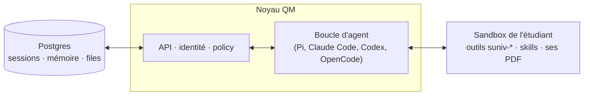

# SUniv

Un agent coworker pour la recherche et la rédaction académiques. Il cherche la
littérature, la classe, l'explique, et aide à écrire le mémoire ou l'article.

## Ce qu'est SUniv

Écrire un mémoire ou un article, ce n'est pas rédiger. C'est jongler entre une douzaine
d'outils qui ne se parlent pas : chercher dans Scopus et Google Scholar, ranger dans
Zotero, lire des PDF, comprendre une méthode qu'on n'a jamais vue, tenir un plan, formater
selon le style imposé, et recommencer six mois plus tard sans se souvenir de ce qu'on
avait décidé.

SUniv est à ce travail ce qu'un agent de code est à un dépôt. Il ne remplace ni Word, ni
LaTeX, ni Zotero : il travaille **avec** eux, et il suit le projet sur toute sa durée. Au
passage, l'étudiant apprend — parce que l'agent explique ce qu'il trouve au lieu de le
résumer.

Il sert aussi les équipes : un laboratoire, ou une startup qui construit un produit **et**
rédige l'article qui le publie ou le protège.

## Fonctionnalités

- **Recherche fédérée.** Huit sources interrogées en parallèle — OpenAlex, Crossref,
  arXiv, Semantic Scholar, Europe PMC, HAL, CORE, Unpaywall — fusionnées par DOI puis par
  titre, et rendues en CSL-JSON. Avec les clés de l'établissement, Scopus et IEEE Xplore
  s'y ajoutent.
- **L'échelle d'ancrage.** Chaque article proposé annonce ce que SUniv en détient
  réellement : texte intégral, résumé seul, ou métadonnées seules. C'est ce qui décide de
  ce qu'il s'autorise à dire — voir plus bas.
- **Zotero, personnel ou d'équipe.** Lecture par l'API locale sans clé, écriture par
  l'API web. Une bibliothèque de groupe rend le travail d'un membre immédiatement
  disponible à tous.
- **Rédaction et export.** Plan, sections, citations rattachées à des références réelles,
  et sortie en `.docx`, `.tex` ou PDF — l'étudiant repart dans Word ou Overleaf quand il
  veut.
- **Brevets et divulgation.** Recherche d'antériorité à l'EPO et à l'USPTO, et un
  garde-fou qui alerte avant qu'un preprint ne détruise la brevetabilité en Europe.
- **Travail d'équipe.** Carnet de laboratoire partagé, digest de ce qui a bougé, et
  explication de la brique qu'un coéquipier construit.
- **Veille.** Un cron surveille le domaine et ne rapporte que ce qui a changé.

## Ce que vous pouvez lui demander

- « Qu'a-t-on publié depuis 2023 sur la calibration des capteurs bas coût ? Range-les
  dans Zotero et fais-moi une matrice comparative. »
- « Explique-moi la méthode de cet article, je ne comprends pas la partie variationnelle. »
- « Mon sujet est trop large. Aide-moi à le réduire à quelque chose que je peux finir en
  quatre mois. »
- « Rédige la section méthode à partir du carnet, puis exporte en .docx au style APA. »
- « On veut mettre le papier sur arXiv la semaine prochaine. »
- « Où en est Marc sur le module de calibration ? »

## Le principe qui gouverne tout

Aucune référence n'entre dans un document sans résoudre à un identifiant réellement
retourné par une recherche. Aucune méthode n'est décrite sans le texte qui la contient.

C'est la raison d'être de l'échelle d'ancrage :

| Ancrage    | Ce dont SUniv dispose                                                           | Ce qu'il s'autorise à dire                                                |
| ---------- | ------------------------------------------------------------------------------- | ------------------------------------------------------------------------- |
| `fulltext` | Un texte récupérable — PDF en accès ouvert, arXiv, PMC, ou le PDF de l'étudiant | Tout ce que le texte soutient, en citant la section                       |
| `abstract` | Le résumé seul                                                                  | Ce que le résumé **déclare**, marqué comme tel. Rien de plus              |
| `metadata` | Titre, auteurs, revue, DOI                                                      | **Rien** sur l'objectif ni la méthode. Il le dit et donne la voie d'accès |

La troisième ligne est celle qui compte. Un agent qui devine la méthodologie d'un article
payant qu'il n'a pas lu produit une revue de littérature fausse et confiante — indétectable
jusqu'à ce que quelqu'un lise l'article. C'est pire qu'inutile pour un chercheur. SUniv
préfère dire qu'il ne sait pas.

## Architecture



SUniv est une **distribution** de [QM](https://github.com/yc-software/qm), un harnais
d'agent multi-joueurs sous licence MIT. QM apporte le noyau générique : boucle d'agent
multi-modèles, scopes personnels et partagés, mémoire durable par scope, keychain, skills,
crons, sandbox par utilisateur, politique de sécurité et audit, et une interface web.

Le noyau expose une surface d'outils fixe dont `execute`. Tout le métier SUniv arrive donc
comme des **binaires installés dans la sandbox** et des **skills** qui apprennent à l'agent
quand les employer — sept outils et douze skills, tous dans
[`deploy/layers/suniv/`](./deploy/layers/suniv/). Le reste de l'arbre reste identique à
l'amont, ce qui permet de continuer à en recevoir les améliorations.
[`SUNIV.md`](./SUNIV.md) décrit la frontière et la procédure de synchronisation.

### Le noyau, dans les termes de l'amont

SUniv n'active ni Slack ni le portail public, mais le noyau les porte : ces surfaces
restent disponibles pour qui en veut. Le README de QM décrit sa topologie ainsi, et nous
la citons telle quelle plutôt que de la paraphraser — c'est le noyau qui l'exécute, pas
SUniv :

> The web UI, the admin panel, and the public portal are optional plugins over the
> core's HTTP API; Slack is an optional in-process plugin that core starts and supervises
> through a direct service client.
>
> The core runs TypeScript directly on Node and uses Fastify for HTTP. The Slack plugin
> uses Bolt; the web UI builds with Vite and renders with Lit.

Ces phrases sont vérifiées par `test/public-architecture-docs.test.ts`, un test amont qui
lit ce fichier pour s'assurer que la documentation ne dérive pas du code. Les modifier
casse la CI.

## Exécuter SUniv

Il faut **Node 24 ou plus**, Docker, une clé de modèle (Anthropic, OpenAI ou OpenRouter),
et un compte Resend ou des identifiants SMTP — le broker d'authentification envoie les
liens de connexion.

```bash
npm install
CFG=deploy/layers/suniv/qm.config.jsonc

npm run sandbox:local:build                          # la base de la sandbox
node cli/bin/qm.ts setup deploy/layers/suniv         # les secrets
node cli/bin/qm.ts check   --config $CFG
node cli/bin/qm.ts sandbox publish --config $CFG
node cli/bin/qm.ts up      --config $CFG --build-from
node cli/bin/qm.ts outputs --config $CFG             # les URL
```

Deux pièges valent d'être connus avant de commencer : `npm exec qm` **ne fonctionne pas**
dans un checkout source (le lien de l'espace de travail pointe vers un `cli/` non
compilé), et `up` exige `--build-from` parce que le manifeste d'images de ce dépôt est un
espace réservé. [`deploy/layers/suniv/FIRST-RUN.md`](./deploy/layers/suniv/FIRST-RUN.md)
donne la séquence complète, les clés gratuites à récupérer d'avance, et l'ordre des
vérifications.

Sans démon Docker, `qm.config.fly.jsonc` déploie les mêmes services sur Fly, dont le
constructeur distant fabrique les images de service ; seule celle de la sandbox demande
encore Docker quelque part, et un workflow GitHub Actions s'en charge.
[`deploy/layers/suniv/FLY.md`](./deploy/layers/suniv/FLY.md) décrit cette voie, ses coûts,
et ce qu'elle ne résout pas — les clés Scopus et IEEE restent liées à l'IP du campus.

Pour travailler sur la couche elle-même :

```bash
cd deploy/layers/suniv && npm test
```

C'est le seul filet de sécurité de la couche : les linters du dépôt ignorent
`deploy/layers/`.

## État

**MVP en construction, et jamais déployé.** Les sept outils sont testés — 53 tests, dont
les parseurs de chaque source — et la chaîne recherche → CSL-JSON → BibTeX → `.docx` avec
citations rendues est vérifiée de bout en bout. En revanche le noyau, l'interface web et
l'authentification n'ont jamais démarré, et **aucune skill n'a encore été exécutée par un
modèle** : c'est la plus grande hypothèse non testée du projet.

Les chemins nécessitant des identifiants (écriture Zotero, Scopus, IEEE, SerpApi, EPO,
PatentsView) sont validés sur des fixtures, pas contre les vrais services. Le recensement
complet de ce qui est vérifié et de ce qui ne l'est pas est tenu à jour dans le plan de
développement.

La suite : l'éditeur intégré, l'add-in Word en modifications suivies, puis l'application
desktop Windows et macOS.

## Personnaliser

Une nouvelle capacité de recherche ou de rédaction se pose dans
`deploy/layers/suniv/sandbox/` — un binaire dans `tools/`, le savoir-faire dans `skills/`.
Une nouvelle surface (éditeur, add-in) devient un plugin de la couche. Rien de tout cela
ne touche au noyau. Voir [`deploy/layers/suniv/sandbox/README.md`](./deploy/layers/suniv/sandbox/README.md)
et [`SUNIV.md`](./SUNIV.md).

## Aller plus loin

- [`deploy/layers/suniv/FIRST-RUN.md`](./deploy/layers/suniv/FIRST-RUN.md) — le premier démarrage, en détail
- [`deploy/layers/suniv/sandbox/README.md`](./deploy/layers/suniv/sandbox/README.md) — les outils et les skills
- [`SUNIV.md`](./SUNIV.md) — la frontière avec le noyau amont
- [`docs/deploy-directory.md`](./docs/deploy-directory.md) — le contrat de déploiement de QM
- [`SECURITY.md`](./SECURITY.md) — le modèle de menace et les postures de sécurité du noyau

## Licence

[MIT](./LICENSE). SUniv est une distribution aval de QM ; voir [`NOTICE`](./NOTICE) pour
l'attribution du travail amont.
